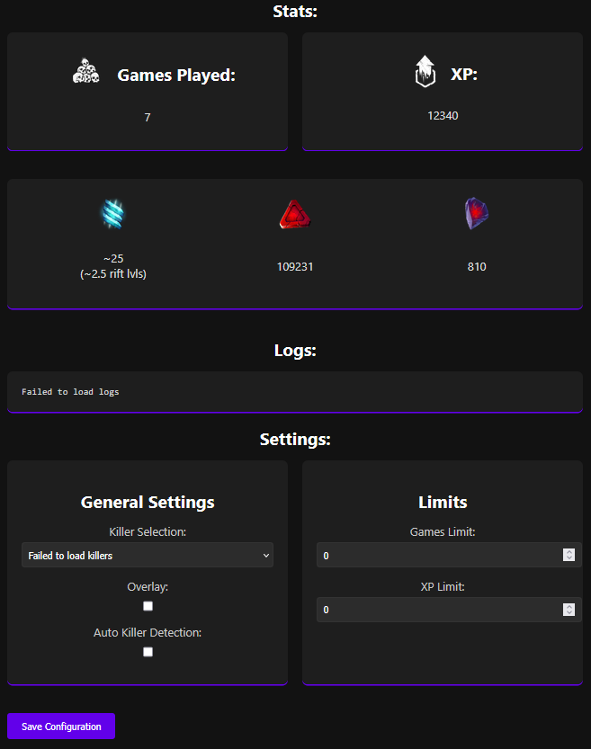
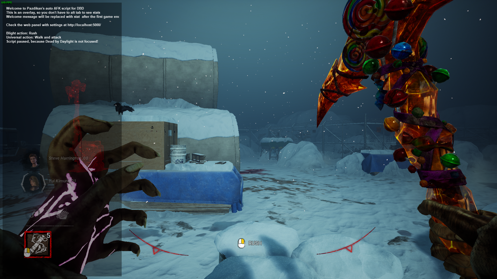

# Easy Anti Cheat detection

> [!CAUTION]
> Recently another python project (auto skillcheck hitter), which I've been inspired by, has been receiving reports about EAC bans. This is most likely due to how keypresses are sent to the system.

**I'm keeping this repository public for educational purposes only.**

**DO NOT USE THIS SCRIPT EVEN IN CUSTOM GAMES!**

# Old feature description:

## Key Features
- ✨ **Anti-AFK System**: Smart movement patterns to prevent disconnection
- 🛡️ **Anti-Banner Protection**: Handles disconnections and loading screen issues
- 🎮 **Killer-Specific Actions**: Optimized behaviors for bloodpoint farming
- 🌐 **Web Control Panel**: Remote management interface
- 📊 **In-Game Overlay**: Real-time stats and logging display
- 📈 **Very Powerful**: Up to 2500xp per hour (6000xp during double xp event)

## How It Works
The script keeps your killer moving and doing their thing to look like a real player. Each killer has their own actions they'll use - this helps rack up those sweet bloodpoints while keeping everything looking normal. Of course, the script is also farming XP by just being in a game (1 second = 1 xp, cap at 10 minutes)

### Supported Killers
| Killer | Actions |
|--------|----------|
| TRAPPER | Placing and picking up traps |
| BLIGHT | Rushing |
| DOCTOR | Static blast and therapy shock |

## Setup Guide

Please follow [the installation guide](GUIDE.md).

### Configuration
Access the web interface at `http://localhost:5000` to customize script settings.

You can also access the web interface from a different machine, at `http://your-pc-local-ip:5000`

## Interface Screenshots

### Control Panel

### In-Game Display

# Thanks

### Rensora

For
- Reporting bugs and suggestions
- Writting the [installation guide](GUIDE.md)

### @Manuteaa

For
- Making the [dbd_autoSkillCheck](https://github.com/Manuteaa/dbd_autoSkillCheck) project. Because of it I decided to rewrite this script.

